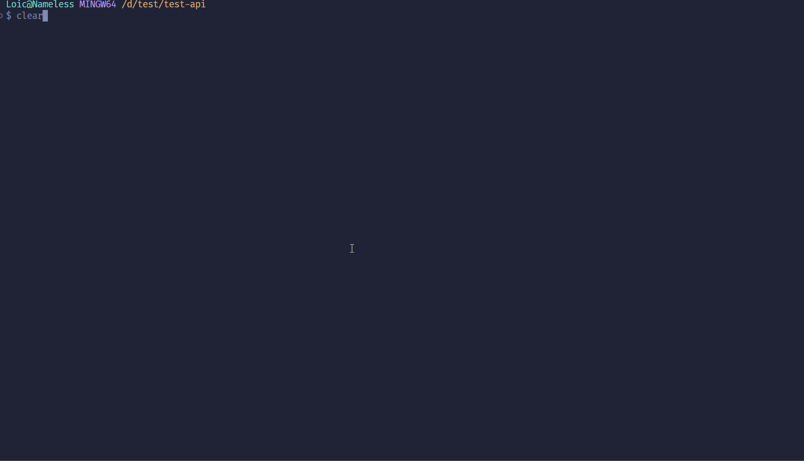
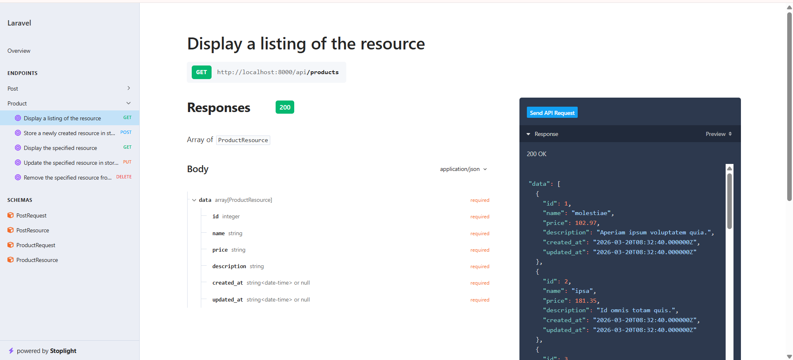
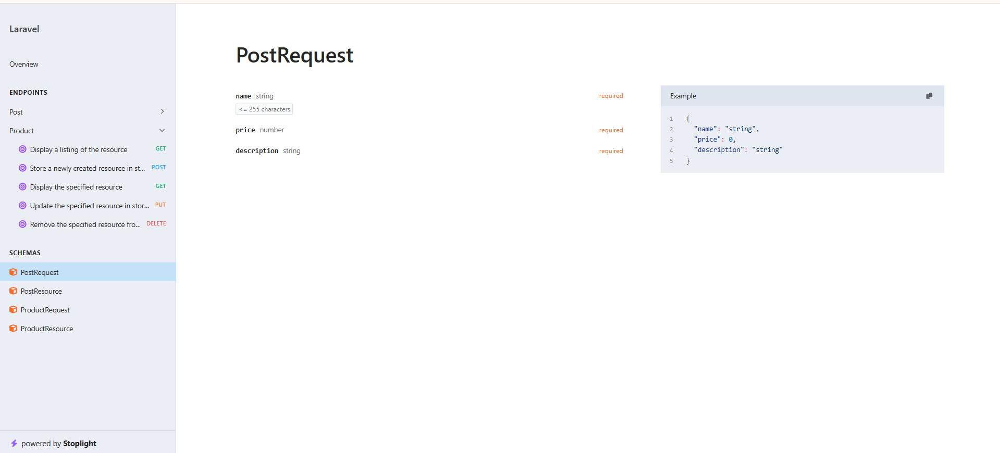
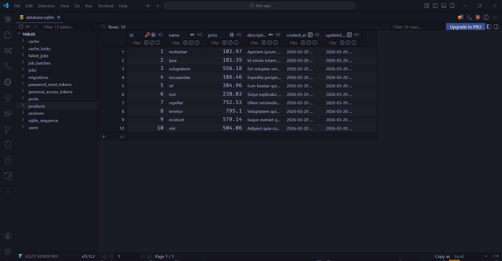
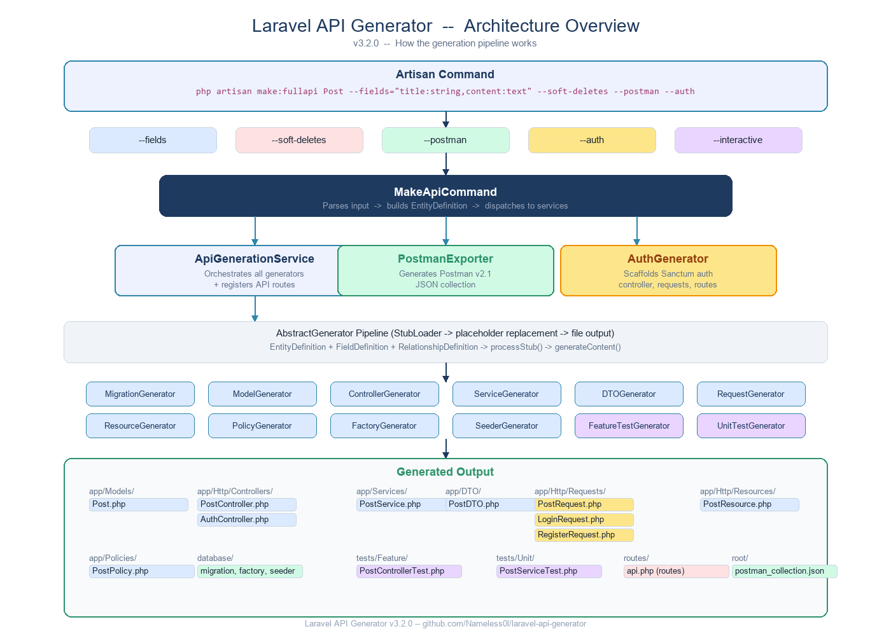

# Laravel API Generator

[](https://packagist.org/packages/nameless/laravel-api-generator)
[](https://packagist.org/packages/nameless/laravel-api-generator)
[](https://packagist.org/packages/nameless/laravel-api-generator)

A professional Laravel package that generates complete, production-ready REST API structures from a single command. Built with clean architecture principles, PHP 8.1+ features, and Laravel best practices.



### VS Code Extension

A visual interface is available: [laravel-api-generator-vscode](https://github.com/Nameless0l/laravel-api-generator-vscode). Generate APIs, run migrations, tests, and browse documentation -- all from VS Code without touching the terminal.

### v3.4 -- Generate, seed, test, document, regenerate, introspect, customize

**Swagger UI** -- automatic interactive API documentation with Scramble:



**Validation schemas** -- your FormRequest rules become typed, documented constraints:



**Database seeding** -- 10 records per entity, ready to use:



---

## Architecture



---

## What it generates

From a single command, the package creates **12 files** per entity and registers the API route:

| Layer | File | Location |
|-------|------|----------|
| Model | `Post.php` | `app/Models/` |
| Controller | `PostController.php` | `app/Http/Controllers/` |
| Service | `PostService.php` | `app/Services/` |
| DTO | `PostDTO.php` | `app/DTO/` |
| Request | `PostRequest.php` | `app/Http/Requests/` |
| Resource | `PostResource.php` | `app/Http/Resources/` |
| Policy | `PostPolicy.php` | `app/Policies/` |
| Factory | `PostFactory.php` | `database/factories/` |
| Seeder | `PostSeeder.php` | `database/seeders/` |
| Migration | `*_create_posts_table.php` | `database/migrations/` |
| Feature Test | `PostControllerTest.php` | `tests/Feature/` |
| Unit Test | `PostServiceTest.php` | `tests/Unit/` |
| Route | `apiResource` entry | `routes/api.php` |

---

## Installation

```bash
composer require nameless/laravel-api-generator
```

The service provider is auto-discovered. No additional configuration required.

---

## Quick start

### Single entity

```bash
php artisan make:fullapi Post --fields="title:string,content:text,published:boolean"
```

### With soft deletes

```bash
php artisan make:fullapi Post --fields="title:string,content:text" --soft-deletes
```

This adds the `SoftDeletes` trait to the model, a `softDeletes()` column in the migration, and `restore` / `forceDelete` endpoints with their routes.

### With Postman collection export

```bash
php artisan make:fullapi Post --fields="title:string,content:text" --postman
```

Generates a `postman_collection.json` at the project root, ready to import. Each entity gets a folder with List, Create, Show, Update, and Delete requests pre-configured with sample data.

### With Sanctum authentication

```bash
php artisan make:fullapi Post --fields="title:string,content:text" --auth
```

This scaffolds a complete Sanctum-based auth system: `AuthController` (register, login, logout, user), `LoginRequest`, `RegisterRequest`, auth routes, and wraps your API resource routes inside `auth:sanctum` middleware.

### Interactive wizard

```bash
php artisan make:fullapi --interactive
```

A step-by-step guided setup that lets you define the entity name, add fields one by one (with type, nullable, unique, and default value options), configure relationships, and preview everything before generation.

### All options combined

```bash
php artisan make:fullapi Post --fields="title:string,content:text" --soft-deletes --postman --auth
```

### Bulk generation from JSON

Create a `class_data.json` file at your project root (or [download the sample Blog schema](examples/class_data.json) with Author, Category, Article, and Tag entities):

```json
[
  {
    "name": "User",
    "attributes": [
      {"name": "name", "_type": "string"},
      {"name": "email", "_type": "string"}
    ],
    "oneToManyRelationships": [
      {"role": "posts", "comodel": "Post"}
    ]
  },
  {
    "name": "Post",
    "attributes": [
      {"name": "title", "_type": "string"},
      {"name": "content", "_type": "text"}
    ],
    "manyToOneRelationships": [
      {"role": "user", "comodel": "User"}
    ]
  }
]
```

Then run:

```bash
php artisan make:fullapi
```

### Delete generated API

```bash
# Delete a specific entity
php artisan delete:fullapi Post

# Delete all entities defined in class_data.json
php artisan delete:fullapi
```

The delete command also unregisters the seeder from `DatabaseSeeder.php` and removes the API route, so your codebase stays clean.

### Regenerate selected files (`--only=`)

Modified your migration and want a fresh `Resource` or `Test` without retyping everything? Use `--only=Type[,Type]` to run only specific generators:

```bash
# Regenerate only the feature & unit tests
php artisan make:fullapi Post --fields="title:string,content:text" --only=FeatureTest,UnitTest

# Regenerate just the Resource
php artisan make:fullapi Post --fields="title:string,content:text" --only=Resource
```

When `--only=` is set, the migration, the `apiResource` route and the `DatabaseSeeder` registration are **left untouched** -- only the listed artifacts are rewritten.

Available types: `Model`, `Controller`, `Service`, `DTO`, `Request`, `Resource`, `Migration`, `Factory`, `Seeder`, `Policy`, `FeatureTest`, `UnitTest`.

### Introspect an existing database

The `api-generator:introspect` command emits the project's database schema as JSON, so any tooling can scaffold APIs on top of legacy databases without retyping the schema:

```bash
# List all user tables (system tables like migrations / sessions / personal_access_tokens are filtered out)
php artisan api-generator:introspect

# Describe one table (column names, normalized types, soft_deletes flag)
php artisan api-generator:introspect --table=products
```

This powers the **Import from Database** feature in the [VS Code extension](https://github.com/Nameless0l/laravel-api-generator-vscode).

### Validate customized stubs

If you customize stubs (see below), `api-generator:validate-stubs` checks that every required `{{placeholder}}` is still present so generation cannot silently produce broken code:

```bash
php artisan api-generator:validate-stubs
php artisan api-generator:validate-stubs --json   # machine-readable, exit code 1 on error
```

Wire this into your CI to catch broken stubs before they reach production.

---

## Customize the generated code (stubs)

Publish the package's stubs to your project so you can edit the templates the generators inject into:

```bash
php artisan vendor:publish --tag=api-generator-stubs
```

This copies every `.stub` into `stubs/vendor/laravel-api-generator/`. The `StubLoader` always checks this folder first and falls back to the package's defaults, so you can override only the stubs you need.

After editing, run `api-generator:validate-stubs` (or let the VS Code extension run it automatically before each generation) to verify your customizations.

---

## Command reference

```
php artisan make:fullapi {name?} {--fields=} {--soft-deletes} {--postman} {--auth} {--interactive} {--only=}
php artisan delete:fullapi {name?} {--force}
php artisan api-generator:introspect {--table=}
php artisan api-generator:validate-stubs {--json}
php artisan api-generator:install
```

| Argument / Option | Description |
|-------------------|-------------|
| `name` | Entity name (PascalCase). Omit to use JSON mode. |
| `--fields` | Field definitions in `name:type` format, comma-separated. |
| `--soft-deletes` | Add SoftDeletes trait, migration column, restore/forceDelete endpoints. |
| `--postman` | Export a Postman v2.1 collection after generation. |
| `--auth` | Scaffold Sanctum authentication (AuthController, requests, routes, middleware). |
| `--interactive` | Launch the step-by-step wizard for guided entity creation. |
| `--only=Type,Type` | Regenerate only the listed artifacts; skip route + seeder registration. |

---

## Supported field types

| Type | Database column | PHP type | Validation rule |
|------|----------------|----------|-----------------|
| `string` | `VARCHAR(255)` | `string` | `string\|max:255` |
| `text` | `TEXT` | `string` | `string` |
| `integer` / `int` | `INTEGER` | `int` | `integer` |
| `bigint` | `BIGINTEGER` | `int` | `integer` |
| `boolean` / `bool` | `BOOLEAN` | `bool` | `boolean` |
| `float` / `decimal` | `DECIMAL(8,2)` | `float` | `numeric` |
| `json` | `JSON` | `array` | `json` |
| `date` / `datetime` / `timestamp` | `TIMESTAMP` | `DateTimeInterface` | `date` |
| `uuid` | `UUID` | `string` | `uuid` |

---

## Relationship types

Supported in JSON mode via `class_data.json`:

| JSON key | Eloquent method | Foreign key |
|----------|----------------|-------------|
| `oneToOneRelationships` | `hasOne()` | On related table |
| `oneToManyRelationships` | `hasMany()` | On related table |
| `manyToOneRelationships` | `belongsTo()` | On current table |
| `manyToManyRelationships` | `belongsToMany()` | Pivot table |

Model inheritance is also supported via the `"parent"` key in JSON definitions.

---

## Generated code examples

### Controller

The generated controller uses constructor injection, DTOs, and delegates to the service layer. The `index` endpoint supports query parameter filtering out of the box.

```php
class PostController extends Controller
{
    public function __construct(
        private readonly PostService $service
    ) {}

    public function index(Request $request)
    {
        $posts = $this->service->getAll($request->query());
        return PostResource::collection($posts);
    }

    public function store(PostRequest $request)
    {
        $dto = PostDTO::fromRequest($request);
        $post = $this->service->create($dto);
        return new PostResource($post);
    }

    public function show(Post $post)
    {
        return new PostResource($post);
    }

    public function update(PostRequest $request, Post $post)
    {
        $dto = PostDTO::fromRequest($request);
        $updatedPost = $this->service->update($post, $dto);
        return new PostResource($updatedPost);
    }

    public function destroy(Post $post)
    {
        $this->service->delete($post);
        return response(null, 204);
    }
}
```

### Service

The service layer handles business logic and supports filtering on fillable fields. Route parameters are accepted as `int|string` to work seamlessly with `declare(strict_types=1)`. With `--soft-deletes`, it also includes `restore()` and `forceDelete()` methods.

```php
class PostService
{
    public function getAll(array $filters = []): Collection
    {
        $query = Post::query();

        foreach ($filters as $field => $value) {
            if (in_array($field, (new Post())->getFillable(), true)) {
                $query->where($field, $value);
            }
        }

        return $query->get();
    }

    public function find(int|string $id): Post
    {
        return Post::findOrFail($id);
    }

    public function create(PostDTO $dto): Post
    {
        return Post::create(get_object_vars($dto));
    }

    public function update(Post $post, PostDTO $dto): Post
    {
        $post->update(get_object_vars($dto));
        return $post->fresh();
    }

    public function delete(Post $post): bool
    {
        return $post->delete();
    }
}
```

### DTO

Readonly data transfer objects with typed properties and a factory method:

```php
readonly class PostDTO
{
    public function __construct(
        public ?string $title,
        public ?string $content,
        public ?bool $published
    ) {}

    public static function fromRequest(PostRequest $request): self
    {
        return new self(
            $request->input('title'),
            $request->input('content'),
            (bool) $request->input('published')
        );
    }
}
```

### Feature test

Automatically generated PHPUnit tests covering all CRUD endpoints:

```php
class PostControllerTest extends TestCase
{
    use RefreshDatabase;

    public function test_can_list_posts(): void
    {
        Post::factory()->count(3)->create();
        $response = $this->getJson('/api/posts');
        $response->assertStatus(200)->assertJsonCount(3, 'data');
    }

    public function test_can_create_post(): void
    {
        $data = ['title' => 'test_title', 'content' => 'Test text content'];
        $response = $this->postJson('/api/posts', $data);
        $response->assertStatus(201);
        $this->assertDatabaseHas('posts', $data);
    }

    // ... show, update, delete, validation tests
}
```

---

## Query parameter filtering

All generated `index` endpoints support filtering by any fillable field via query parameters:

```
GET /api/posts?published=true
GET /api/users?name=John
GET /api/products?category=electronics&in_stock=true
```

Only fields declared in the model's `$fillable` array are accepted as filters. Other parameters are silently ignored.

---

## Soft deletes

When using `--soft-deletes`, the generator adds:

- `SoftDeletes` trait and import to the model
- `$table->softDeletes()` to the migration
- `restore()` and `forceDelete()` methods to the controller and service
- Two additional routes:

```
POST   /api/posts/{id}/restore
DELETE /api/posts/{id}/force-delete
```

---

## Postman collection

The `--postman` flag generates a `postman_collection.json` file at the project root. The collection follows the Postman v2.1 schema and includes:

- A folder per entity
- Pre-configured requests for List, Create, Show, Update, and Delete
- Sample request bodies with appropriate field values
- A `base_url` variable (defaults to `http://localhost:8000/api`)

Import the file directly into Postman to start testing immediately.

---

## Sanctum authentication

The `--auth` flag scaffolds a complete token-based authentication system using Laravel Sanctum:

**Generated files:**

- `app/Http/Controllers/AuthController.php` -- register, login, logout, user endpoints
- `app/Http/Requests/LoginRequest.php` -- email + password validation
- `app/Http/Requests/RegisterRequest.php` -- name, email, password + confirmation validation

**Generated routes:**

```php
// Public
POST /api/register
POST /api/login

// Protected (auth:sanctum)
POST /api/logout
GET  /api/user

// Your API resources are also wrapped in auth:sanctum
GET  /api/posts          (requires token)
POST /api/posts          (requires token)
// ...
```

After running with `--auth`, install Sanctum if not already present:

```bash
composer require laravel/sanctum
php artisan vendor:publish --provider="Laravel\Sanctum\SanctumServiceProvider"
php artisan migrate
```

Add the `HasApiTokens` trait to your `User` model, and your API is secured.

---

## Interactive mode

The `--interactive` flag launches a step-by-step wizard that guides you through entity creation:

1. **Entity name** -- enter the model name in PascalCase
2. **Fields** -- add fields one by one, choosing type, nullable, unique, and default value for each
3. **Relationships** -- optionally add belongsTo, hasMany, hasOne, or belongsToMany relations
4. **Options** -- enable soft deletes, Sanctum auth, Postman export
5. **Preview** -- review the full entity definition and file list before confirming
6. **Generate** -- confirm and generate all files

This mode is ideal for developers who prefer a guided experience or want to configure field constraints (unique, defaults) that aren't available in the `--fields` string syntax.

---

## Extending the generator

Create a custom generator by extending `AbstractGenerator`:

```php
use nameless\CodeGenerator\EntitiesGenerator\AbstractGenerator;
use nameless\CodeGenerator\ValueObjects\EntityDefinition;

class CustomGenerator extends AbstractGenerator
{
    public function getType(): string
    {
        return 'Custom';
    }

    public function getOutputPath(EntityDefinition $definition): string
    {
        return app_path("Custom/{$definition->name}Custom.php");
    }

    protected function getStubName(): string
    {
        return 'custom'; // loads stubs/custom.stub
    }

    protected function getReplacements(EntityDefinition $definition): array
    {
        return ['modelName' => $definition->name];
    }

    protected function generateContent(EntityDefinition $definition): string
    {
        return $this->processStub($definition);
    }
}
```

Register it in your service provider and it will be called automatically during generation.

---

## API documentation with Scramble

The package integrates seamlessly with [Scramble](https://github.com/dedoc/scramble) to provide **automatic, interactive API documentation** -- no annotations or manual setup required.


### Setup

```bash
composer require dedoc/scramble --dev
php artisan serve
```

Then open [http://localhost:8000/docs/api](http://localhost:8000/docs/api) in your browser.

### What you get

Scramble automatically analyzes your generated controllers, requests, and resources to produce a full **OpenAPI 3.x specification** with:

- **Interactive Swagger UI** -- test endpoints directly from the browser with "Send API Request"
- **Auto-detected schemas** -- `ProductRequest`, `ProductResource`, etc. are inferred from your FormRequest rules and API Resource structure
- **Validation rules as constraints** -- `required|string|max:255` becomes a required string field with `<= 255 characters` in the docs
- **Request/response examples** -- sample JSON bodies are generated automatically
- **Grouped endpoints** -- each entity (Product, Post, etc.) gets its own section with all CRUD operations


### Endpoints

| URL | Description |
|-----|-------------|
| `/docs/api` | Interactive Swagger UI |
| `/docs/api.json` | Raw OpenAPI 3.x JSON specification |

> **Note:** Scramble is a dev dependency. It won't affect your production deployment.

---

## Database seeding

Generated seeders are automatically registered in `DatabaseSeeder.php`. After generating your API and running migrations:

```bash
php artisan migrate:fresh --seed
```

Each entity seeder creates **10 records** using the generated factory. The `delete:fullapi` command also cleans up the seeder registration.


---

## Development

```bash
# Install dependencies
composer install

# Run tests
composer test

# Static analysis
composer analyse

# Code formatting
composer format
```

### Local testing in a Laravel project

Add the package as a path repository in your Laravel project's `composer.json`:

```json
{
    "repositories": [
        {
            "type": "path",
            "url": "../laravel-api-generator",
            "options": {"symlink": true}
        }
    ],
    "require": {
        "nameless/laravel-api-generator": "@dev"
    }
}
```

Then run `composer update`.

---

## Requirements

- PHP >= 8.2
- Laravel 10.x, 11.x, or 12.x

---

## Contributing

Contributions are welcome. Please see [CONTRIBUTING.md](CONTRIBUTING.md) for details.

---

## Security

If you discover a security vulnerability, please email loicmbassi5@gmail.com instead of using the issue tracker.

---

## Credits

- [Mbassi Loic Aron](https://github.com/Nameless0l)

---

## Changelog

See [CHANGELOG.md](CHANGELOG.md) for the full version history.

---

## License

MIT. See [LICENSE](LICENSE.md) for details.
